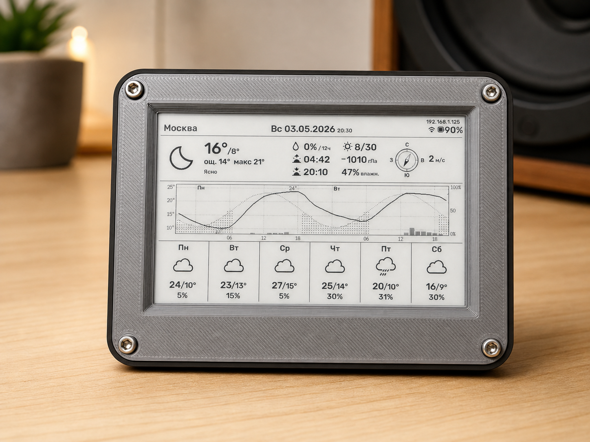
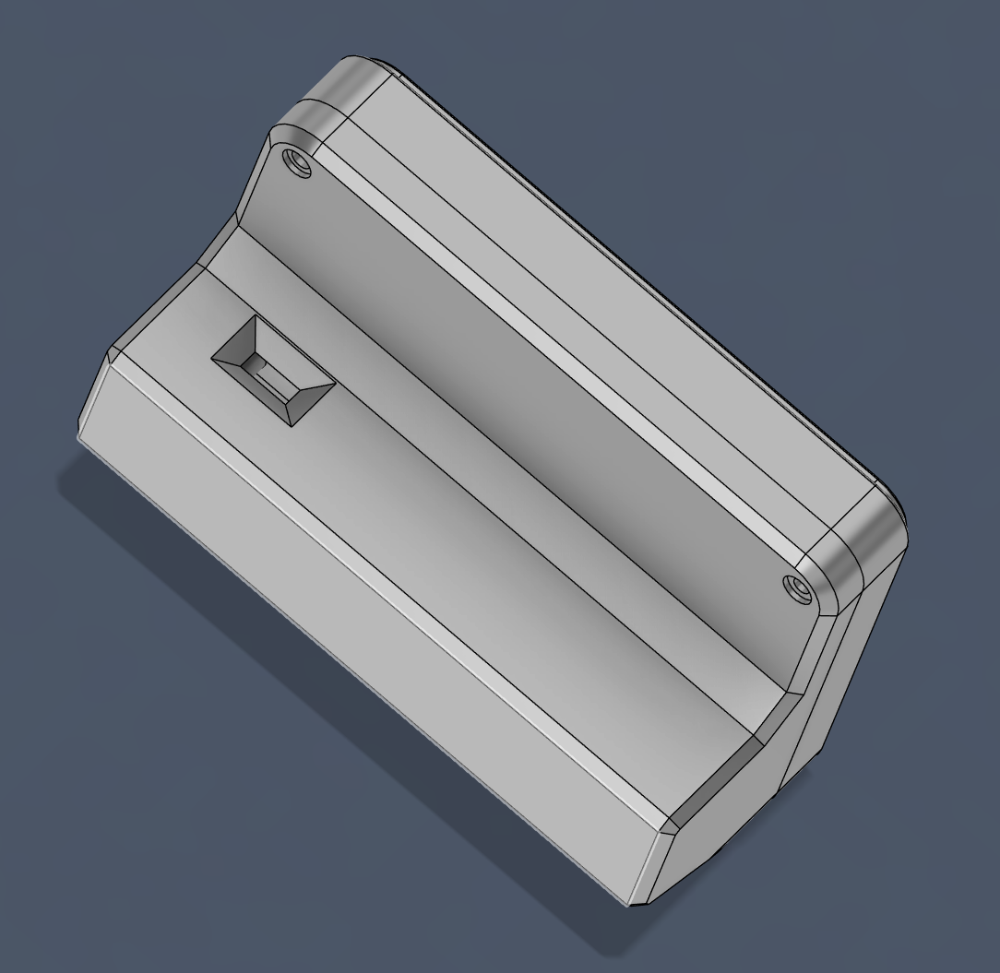
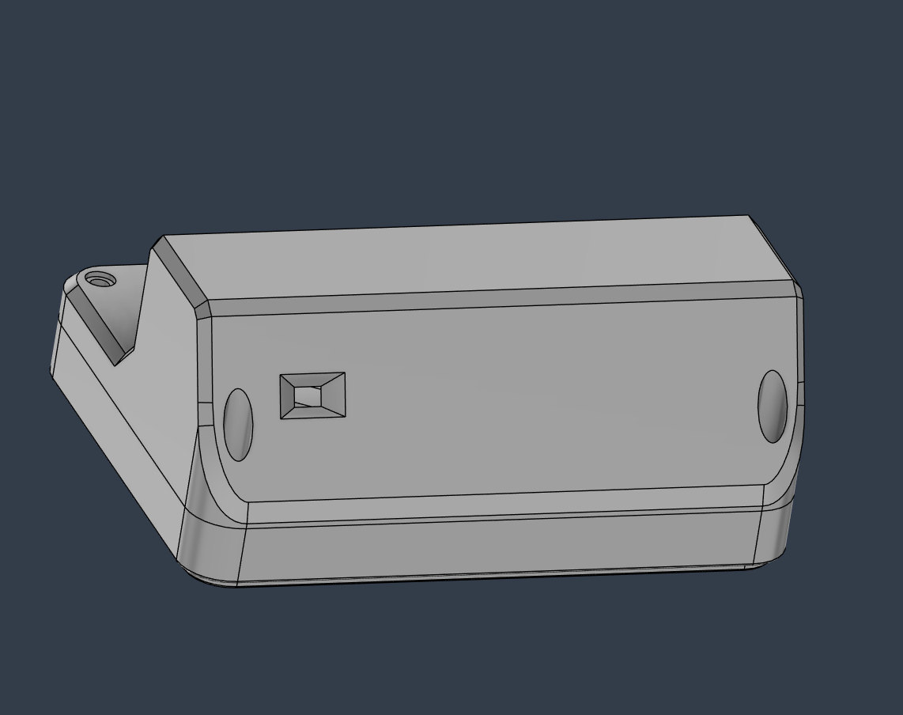

# Inkcast



Метеостанция на ESP32-S3 с e-ink дисплеем и питанием от батареи. Показывает текущую погоду, 48-часовой график температуры и осадков, 6-дневный прогноз, заряд батареи, уровень WiFi, восход/закат, счётчик солнечных дней.

Два источника погоды на выбор:
- **Open-Meteo** — бесплатно, без API ключа, доступен из России. Выбор модели прогноза (ICON, ECMWF, GFS и др.)
- **OpenWeatherMap One Call 3.0** — требует API ключ (1000 запросов/день бесплатно)

Обновление — раз в 2 часа по умолчанию (настраивается 1..1440 мин), между обновлениями ESP32 спит в deep sleep. Все параметры редактируются через встроенную веб-админку — без перепрошивки. Часовой пояс определяется автоматически по координатам.

## Железо

| Компонент | Описание |
|-----------|----------|
| LILYGO T-Energy-S3 | ESP32-S3, управление питанием, 18650 батарея |
| GDEM0397T81P | 3.97" e-paper дисплей (800x480, ч/б) |
| DESPI-C02 | Переходная плата Good Display для подключения e-paper по SPI |

## Корпус

3D-печатный корпус с вырезами под USB-C (зарядка / прошивка) и кнопку питания на задней грани — без разборки можно зарядить аккумулятор и включать/выключать устройство.

STL-файлы для печати:
- [Printables](https://www.printables.com/model/1709801-inkcast)
- [Thingiverse](https://www.thingiverse.com/thing:7346784)

| Вырез под USB-C | Вырез под выключатель |
|---|---|
|  |  |

## Крепёж

Для сборки 3D-печатного корпуса.

| Позиция | Кол-во | Назначение |
|---|---|---|
| Heat-set втулка M3 (вплавляемая) | 4 | впаиваются паяльником в стойки корпуса — дают надёжную резьбу M3 в пластике |
| Болт M3×8 DIN 912 (шестигранник) | 4 + 4 | стяжка корпуса; вариант: 4×M3×8 + 4×M3×10, либо все 8 одной длины — 8×M3×8 |
| Болт M2×6 | 4 | крепление платы LILYGO T-Energy-S3 к корпусу |

## Подключение

### E-paper → DESPI-C02

FPC-шлейф дисплея вставляется в разъём на DESPI-C02:
1. Поднять защёлку FPC-коннектора
2. Вставить шлейф контактами вниз
3. Закрыть защёлку

### DESPI-C02 → T-Energy-S3

Соединение дюпонт-проводами:

| DESPI-C02 | T-Energy-S3 | GPIO | Функция |
|-----------|-------------|------|---------|
| VCC | 3.3V | — | Питание дисплея |
| GND | GND | — | Земля |
| DIN | MOSI | 11 | SPI данные |
| CLK | SCK | 12 | SPI тактовый |
| CS | — | 10 | Chip Select |
| DC | — | 9 | Data/Command |
| RST | — | 8 | Reset |
| BUSY | — | 7 | Сигнал занятости |

> **Важно:** проверь распиновку на силкскрине своей платы — номера GPIO могут отличаться в разных ревизиях T-Energy-S3.

### Схема

```
  T-Energy-S3                DESPI-C02              GDEM0397T81P
 ┌────────────┐           ┌───────────┐           ┌─────────────┐
 │        3.3V├───────────┤VCC        │           │             │
 │         GND├───────────┤GND    [FPC connector]─┤  FPC шлейф  │
 │      GPIO11├───────────┤DIN        │           │             │
 │      GPIO12├───────────┤CLK        │           └─────────────┘
 │      GPIO10├───────────┤CS         │
 │       GPIO9├───────────┤DC         │
 │       GPIO8├───────────┤RST        │
 │       GPIO7├───────────┤BUSY       │
 │            │           └───────────┘
 │       GPIO3│ <- ADC батареи (встроенный делитель)
 │       GPIO6│ <- Debug jumper (на GND = режим отладки + админка)
 │            │
 │  [18650]   │
 └────────────┘
```

### Режим отладки

Устройство переходит в **режим отладки** автоматически при любом из условий:
- **USB подключён к компьютеру** (`HWCDC::isPlugged()`) — основной триггер. Подключил кабель = не спим, Serial Monitor работает, админка доступна
- **Debug jumper замкнут** (GPIO 6 → GND) — аварийный вход, когда компьютера нет, но нужна админка через WiFi

В режиме отладки:
- Deep sleep отключён, устройство остаётся включённым
- Запускается веб-админка для изменения настроек (см. раздел «Веб-админка»)
- Если сохранённый WiFi не подключается — поднимается точка доступа `ESP-Weather-Setup` для первичной настройки

В обычной работе (USB отключён, jumper разомкнут) — устройство работает по штатному циклу с deep sleep.

> **Важно:** пока USB-кабель подключён к компьютеру, устройство **никогда не уйдёт в deep sleep** — даже без джампера. Отключи кабель для автономной работы от батареи.

## Настройка

Все настройки можно задать через веб-админку (runtime, NVS — переживает deep sleep и перезагрузки) или через `config.h` (defaults для первой прошивки). Runtime-значения имеют приоритет.

### 1. Секреты (`secrets.h`)

```bash
cp inkcast/secrets.h.example inkcast/secrets.h
```

Впиши свои WiFi и (опционально) OWM API ключ:

```cpp
#define WIFI_SSID     "MyWiFi"
#define WIFI_PASSWORD "password123"
#define OWM_API_KEY   ""              // не нужен для Open-Meteo
```

`secrets.h` в `.gitignore` — не попадёт в репозиторий. Можно оставить плейсхолдеры и настроить всё через админку после прошивки.

### 2. Defaults в `config.h`

Координаты, город и период обновления:

```cpp
#define OWM_LAT              "55.7558"           // широта
#define OWM_LON              "37.6176"           // долгота
#define OWM_CITY             "Москва"            // название для дисплея
#define SLEEP_DURATION_MIN   120                 // период обновления, мин
```

Используются на первой прошивке (NVS пуст). После сохранения через админку — берутся из NVS.

**Провайдер погоды** выбирается в админке:
- **Open-Meteo** (по умолчанию) — не требует ключа, работает сразу. Можно выбрать модель прогноза (Best Match, ECMWF, ICON, GFS, GEM).
- **OpenWeatherMap** — требует API ключ. Подписка **One Call API 3.0** на [openweathermap.org](https://openweathermap.org/api/one-call-3), бесплатный план: 1000 запросов/день.

Часовой пояс определяется автоматически из ответа погодного API по координатам (с учётом DST). `UTC_OFFSET_SEC` — fallback до первого успешного запроса.

### 3. Сборка и прошивка через Arduino IDE

#### 3.1. Что нужно поставить

**ESP32 board package** — `File → Preferences → Additional Boards Manager URLs`, добавь:

```
https://raw.githubusercontent.com/espressif/arduino-esp32/gh-pages/package_esp32_index.json
```

Затем `Tools → Board → Boards Manager` → найди **esp32 by Espressif Systems** → поставь **2.0.14 или новее** (3.x тоже работает).

**Библиотеки** — `Sketch → Include Library → Manage Libraries`:

| Библиотека | Автор | Мин. версия | Зачем |
|---|---|---|---|
| `GxEPD2` | Jean-Marc Zingg | **1.5.5+** | Драйвер e-paper, нужен класс `GxEPD2_397_GDEM0397T81` (добавлен в 1.5.5) |
| `ArduinoJson` | Benoit Blanchon | **7.0+** | Парсинг JSON (OWM и Open-Meteo). API v7: `JsonDocument` без размера, `is<long>()` — на v6 не соберётся |
| `U8g2_for_Adafruit_GFX` | olikraus | 1.8.0+ | Кириллица + ° через `drawUTF8` поверх Adafruit GFX |

`Adafruit GFX Library` и `Adafruit BusIO` подтянутся автоматически как транзитивные зависимости.

#### 3.2. Настройки `Tools` (для ESP32S3 Dev Module)

После выбора `Board → ESP32 Arduino → ESP32S3 Dev Module` в меню `Tools` появятся опции. Выстави так:

| Опция | Значение | Критично? |
|---|---|---|
| Board | ESP32S3 Dev Module | ✓ |
| USB CDC On Boot | **Enabled** | ✓ — Serial идёт через USB-C, без переходника |
| CPU Frequency | 240MHz (WiFi) | дефолт |
| Core Debug Level | None | дефолт |
| USB DFU On Boot | Disabled | дефолт |
| Erase All Flash Before Sketch Upload | Disabled | для первой прошивки можно Enabled |
| Events Run On | Core 1 | дефолт |
| Flash Mode | QIO 80MHz | дефолт |
| Flash Size | **16MB (128Mb)** | ✓ |
| JTAG Adapter | Disabled | дефолт |
| Arduino Runs On | Core 1 | дефолт |
| USB Firmware MSC On Boot | Disabled | дефолт |
| Partition Scheme | **16M Flash (3MB APP/9.9MB FATFS)** или **Huge APP (3MB No OTA/1MB SPIFFS)** | ✓ — см. ниже |
| PSRAM | **OPI PSRAM** | ✓ — T-Energy-S3 имеет octal PSRAM, без этого `BOARD_HAS_PSRAM` не сработает |
| Upload Mode | UART0 / Hardware CDC | дефолт |
| Upload Speed | 921600 |  |
| USB Mode | Hardware CDC and JTAG | дефолт (раз CDC On Boot включён) |

> ⚠️ **Partition Scheme критичен.** Прошивка ~1.3MB (≈половину занимают шрифты Rubik в u8g2-формате и битмапы погодных иконок 96×96). **Стандартная схема `Default 4MB with spiffs` НЕ подойдёт** — у неё APP-раздел всего 1.25MB, и линкер упадёт с ошибкой *"Sketch too big; text section exceeds available space in board"*. Нужна схема с APP ≥ 1.5MB; рекомендуемые выше дают 3MB и работают с большим запасом. Прошивка не использует OTA / SPIFFS / FATFS — только NVS (есть во всех схемах), так что выбор между двумя рекомендованными не принципиален.

#### 3.3. Прошивка

1. Подключи плату по USB-C.
2. `Tools → Port` → выбери COM-порт устройства.
3. Открой `inkcast/inkcast.ino`.
4. `Sketch → Upload` (или `Ctrl+U`).
5. После окончания загрузки открой `Tools → Serial Monitor` на **115200 baud** — увидишь лог инициализации, подключения к WiFi и обновления экрана.

> **Если COM-порт не появляется** — зажми кнопку BOOT, кратко нажми RESET, отпусти BOOT. Это переведёт ESP32-S3 в bootloader-режим, после чего порт станет видимым. Иногда нужно для самой первой прошивки.

### 4. Веб-админка (runtime настройки)

После прошивки можно менять параметры без перепрошивки — через встроенный веб-сервер. Активна **только в режиме отладки** (USB подключён к компьютеру или джампер GPIO 6 замкнут на GND).

**Как зайти:**

1. Подключи устройство по USB к компьютеру (или замкни debug-джампер GPIO 6 → GND), перезагрузи.
2. Открой Serial Monitor (115200 baud) — там появится строка `[ADMIN] Web-админка: http://<ip>/`. IP также показывается на дисплее в правом верхнем углу статус-бара.
3. Зайди браузером с любого устройства в той же сети — увидишь форму с полями WiFi/OWM/локация.
4. Сохрани → устройство автоматически перезагрузится с новыми настройками.
5. Отключи USB-кабель (или сними джампер) → устройство переходит в обычный режим с deep sleep.

**Первичная настройка / сломанный WiFi (AP fallback):**

Если сохранённый WiFi не подключается (например, сменили роутер) — устройство в debug-режиме автоматически поднимает свою открытую точку доступа `ESP-Weather-Setup`. На дисплее появится строка `Setup mode | WiFi: ESP-Weather-Setup | http://192.168.4.1/`.

1. Подключись с телефона/ноута к сети `ESP-Weather-Setup` (без пароля).
2. Открой `http://192.168.4.1/`.
3. Введи новые WiFi-параметры → сохрани → устройство перезагрузится и подключится к нужной сети.

**Что можно править через админку:** провайдер погоды (OWM / Open-Meteo), модель прогноза Open-Meteo, OWM API-ключ, WiFi SSID + пароль, широта, долгота, название города, период обновления (1..1440 мин). Для каждого провайдера есть кнопка «Проверить» — тестирует соединение без сохранения. Кнопка «Сбросить к заводским» — очищает NVS, после reboot грузятся defaults из `config.h`.

**Авторизация отсутствует** — расчёт на доверенную домашнюю сеть. Если устройство в общем WiFi — добавь Basic Auth в `admin_server.cpp` или вынеси в отдельную сеть.

## Что на экране

```
┌─────────────────────────────────────────────────────────────────┐
│                                              192.168.1.42       │
│ Москва        Ср 26.03.2025 14:30      [(!)] [WiFi] [88%]       │  Статус-бар (48px)
├─────────────────────────────────────────────────────────────────┤
│              │                                                  │
│  [иконка]    │  -3°  /мин°     [капля] 30%                      │
│   96x96      │  ощ. -7° / макс 0°      /12ч                     │  Текущая погода (120px)
│              │  Переменная облачность  [восход] 06:32           │
│              │                         [закат]  19:45           │
│              │                         [солнце] 3/14 дн.        │
├─────────────────────────────────────────────────────────────────┤
│  (синусоида солнца, штрихованные столбцы осадков,               │
│   линия температуры 2px, метки °C слева, % справа,              │  График 48ч (156px)
│   полночные разделители с именами дней,                         │
│   метки времени каждые 6ч)                                      │
├──────────┬──────────┬──────────┬──────────┬──────────┬──────────┤
│    Вт    │    Ср    │    Чт    │    Пт    │    Сб    │    Вс    │
│ [иконка] │ [иконка] │ [иконка] │ [иконка] │ [иконка] │ [иконка] │  Прогноз 6 дней (156px)
│  64x64   │  64x64   │  64x64   │  64x64   │  64x64   │  64x64   │
│ 0°/мин°  │ 2°/мин°  │ 5°/мин°  │ 1°/мин°  │ -2°/мин° │  0°/мин° │
│   40%    │    20%   │    5%    │   60%    │   30%    │   10%    │
└──────────┴──────────┴──────────┴──────────┴──────────┴──────────┘
```

**Зоны дисплея (800x480):**

| Зона | Высота | Содержимое |
|------|--------|------------|
| Статус-бар | 48px | Город (24px), дата + время («Ср 26.03.2025 14:30», дата 24px + время 14px на одной baseline), IP-адрес 14px справа сверху над иконками, иконки WiFi + батарея + %. При неудачном обновлении погоды добавляется круглый индикатор `(!)` слева от иконок WiFi/батареи — данные на дисплее устарели |
| Текущая погода | 120px | Иконка 96x96, температура, ощущаемая, мин/макс, описание, осадки за 12ч, восход/закат, счётчик солнечных дней, давление с трендом, влажность, компас ветра |
| График | 156px | 48ч почасовой: синусоида солнца, температура, осадки |
| Прогноз | 156px | 6 дней: иконка 64x64, мин/макс, осадки %. Колонки по `800/6 ≈ 133px`, иконка центрирована с зазорами ~34px по бокам |

**Счётчик солнечных дней:** NVS-трекер хранит 30-дневную битовую маску. Каждый цикл обновления проверяет облачность — если `clouds < 50%`, день считается солнечным (бит = 1). На дисплее отображается как `X/Y дн.` (X солнечных из Y отслеживаемых). Данные переживают deep sleep и перезагрузки. Работает одинаково для обоих провайдеров — оба заполняют поле `clouds`.

**Поведение при ошибке обновления погоды:**

Если очередной fetch упал (нет WiFi / API недоступен / ключ невалиден), e-ink **не перерисовывается полностью** — данные предыдущего успешного цикла остаются на экране. Вместо этого делается **partial update только статус-бара**: добавляется иконка-индикатор `(!)` рядом с WiFi/батареей. На следующем успешном цикле всё перерисовывается полностью, индикатор уходит автоматически. На самом первом запуске (когда данных ещё нет) показывается полноэкранная карточка ошибки.

## Симулятор дисплея (`sim/`)

Компилирует **настоящий** `display_renderer.cpp` в WebAssembly через Emscripten. Правишь C++ → пересобираешь → обновляешь браузер. Ноль ручного портирования.

```bash
# Одноразовая установка Emscripten (~3 мин):
git clone https://github.com/emscripten-core/emsdk.git C:/tools/emsdk
cd C:/tools/emsdk && ./emsdk install latest && ./emsdk activate latest

# Сборка (~3 сек):
cd sim/wasm && bash build.sh

# Запуск:
cd sim && python -m http.server 8088
# Открыть http://localhost:8088/wasm/
```

**Рабочий цикл:** правишь `display_renderer.cpp` → `bash sim/wasm/build.sh` → F5 в браузере.

Mock-заголовки в `sim/wasm/mocks/` подменяют Arduino/GxEPD2/U8g2 на desktop-совместимые реализации (1bpp framebuffer вместо SPI). Реальная библиотека `U8g2_for_Adafruit_GFX` компилируется напрямую — шрифтовой рендеринг идентичен прошивке.

Сценарии данных: `sim/scenarios/` — `default`, `night`, `rain`, `sunny`, `low_battery`, `api_error`.

## Структура проекта

```
inkcast/          — прошивка ESP32-S3 (Arduino IDE)
├── inkcast.ino   — точка входа, WiFi, deep sleep / admin loop, оркестрация
├── config.h                    — defaults для координат/GPIO/timezone, подключает secrets.h
├── secrets.h                   — WiFi пароль, OWM ключ (в .gitignore, см. secrets.h.example)
├── secrets.h.example           — шаблон secrets.h с плейсхолдерами
├── settings.h                  — runtime-настройки в NVS (WiFi, провайдер, ключи, локация)
├── admin_server.h/.cpp         — WebServer (порт 80): настройки, выбор провайдера, тест соединения
├── weather_api.h/.cpp          — мульти-провайдер: OWM One Call 3.0 + Open-Meteo
├── open_meteo_map.h            — маппинг WMO-кодов → иконки + русские описания
├── display_renderer.h/.cpp     — 4-зонный e-paper рендеринг (показывает IP на статус-баре)
├── battery.h                   — ADC батареи (16 замеров, калибровка analogReadMilliVolts, LiPo discharge curve)
├── time_utils.h                — localTm(), dayNameFromTimestamp(), formatDate/Time(), formatDateTimeCompact()
├── sunny_tracker.h             — NVS трекер солнечных дней (30-дневная битовая маска)
├── icons.h                     — UI иконки: 16x16 (WiFi, батарея), 24x24 (восход, закат, капля), 28x28 (солнце)
├── weather_icons.h             — погодные иконки 96x96 + 64x64 (авто-генерация)
└── rubik_fonts_u8g2.h          — шрифты Rubik в формате u8g2 (Cyrillic + ° + ASCII)

sim/                            — WASM-симулятор дисплея
├── wasm/                       — сборка и mock-слой
│   ├── mocks/                  — mock Arduino/GxEPD2/U8g2 для desktop-сборки
│   ├── entry.cpp               — WASM entry: exports для JS
│   ├── u8g2_font_7x14.cpp      — шрифт chart-осей из u8g2
│   ├── build.sh                — Emscripten сборка → renderer.js + .wasm
│   └── index.html              — Canvas + контрольная панель
├── scenarios/                  — данные для симулятора (default, night, rain, sunny, ...)
└── tools/extract_assets.py     — экспорт шрифтов/иконок/layout-констант из прошивки

tools/                          — генераторы для прошивки (Python + Pillow/freetype-py)
├── generate_icons.py           — генератор weather_icons.h (96+64px из WU 128x128)
├── generate_u8g2_font.py       — генератор rubik_fonts_u8g2.h (TTF → BDF → u8g2 через bdfconv)
└── fonts/
    └── Rubik-Variable.ttf
```

## Энергопотребление

- Активная фаза (WiFi connect + TLS + API fetch + рендер): ~10-15 сек, ~120 мА средний ток
- Deep sleep: ~10 мкА (с `gpio_hold_en` для CS/DC/RST/BUSY — `SPI.end()` + фиксация GPIO предотвращают паразитную утечку)
- Bluetooth-контроллер отключён при старте (с проверкой `esp_bt_controller_get_status()`)
- NTP не используется — точное время приходит из ответа погодного API (`timezone_offset` / `utc_offset_seconds`)
- TLS с валидацией сертификата (ISRG Root X1 для OWM). Open-Meteo через Cloudflare без пиннинга CA
- ArduinoJson фильтр парсит только нужные поля — ~60-70% экономии RAM vs полный DOM
- DNS переключён на Google (8.8.8.8) / Cloudflare (1.1.1.1) после подключения WiFi — решает проблему кэширования нерабочих IP роутером
- Расход ~5-6 мА·ч/день при обновлении раз в 2 часа (12 циклов/день)
- **На батарее 2000 мА·ч — ориентировочно ~1 год**, на 3000 мА·ч — ~1.5 года
- **Режим отладки** (USB подключён или джампер замкнут): deep sleep отключён, WiFi и админка работают непрерывно — батарея сядет за пару дней. Отключи USB-кабель для автономной работы.

## Troubleshooting

| Проблема | Решение |
|----------|---------|
| `GxEPD2_BW.h: No such file or directory` при компиляции | Не установлены библиотеки. См. [раздел 3.1](#31-что-нужно-поставить) — поставь GxEPD2, ArduinoJson 7.x и U8g2_for_Adafruit_GFX через Library Manager |
| `Sketch too big; text section exceeds available space in board` | Неправильный Partition Scheme. `Tools → Partition Scheme` → выбери **`16M Flash (3MB APP/9.9MB FATFS)`** или **`Huge APP (3MB No OTA/1MB SPIFFS)`**. Дефолтная схема даёт всего 1.25MB на APP, прошивка ~1.3MB не помещается |
| `JsonDocument` / `is<long>` — нет такого метода | Стоит ArduinoJson 6.x. Обнови до 7.0+ через Library Manager (выпадающий список версий) |
| COM-порт не появляется при подключении | Зажми `BOOT`, кратко нажми `RESET`, отпусти `BOOT` — переведёт ESP32-S3 в bootloader |
| Дисплей не обновляется | Проверь пины CS/DC/RST/BUSY, питание 3.3V |
| Белый экран | Попробуй другой класс дисплея в `display_renderer.h` |
| WiFi не подключается | Проверь SSID/пароль, увеличь `WIFI_TIMEOUT_SEC` |
| Ошибка 401 на экране (OWM) | Проверь API-ключ — неверный или не активирован. Или переключись на Open-Meteo (ключ не нужен) |
| Ошибка 429 на экране (OWM) | Превышен лимит запросов One Call 3.0 |
| OWM connection refused | OWM-серверы периодически недоступны из некоторых регионов. Переключись на Open-Meteo в админке |
| Неверная температура | Проверь координаты (широта/долгота) в админке |
| Неверное время | Часовой пояс определяется по координатам — проверь lat/lon в админке |
| Батарея показывает 0% | Для T-Energy-S3 V1.0 используй `BAT_ADC_PIN = 3`; если у тебя другая ревизия, сверь BAT pin по силкскрину/схеме |
| Экран не обновился после ошибки | Нормально: если экран уже показывал данные, при ошибке они сохраняются. В правом верхнем углу статус-бара появится круглая иконка `(!)` — индикатор «последняя попытка обновления упала, данные устарели». При следующем успешном fetch иконка автоматически уходит |
| Не могу зайти в админку | Админка работает только в режиме отладки — подключи USB к компьютеру или замкни джампер GPIO 6 на GND. IP смотри на дисплее или в Serial Monitor |
| Сменился пароль WiFi — устройство недоступно | Замкни джампер, перезагрузи. После 15 сек неудачных попыток подключения автоматически поднимется AP `ESP-Weather-Setup` (192.168.4.1), через неё введи новый пароль |
| Админка показывает «Ошибка: широта должна быть числом…» | В полях lat/lon — английская точка как разделитель десятичных, не запятая (`55.7558`, не `55,7558`) |
